# demo-for-IdeaModule
1. web框架中常出现的web目录的创建
2. 点击右下角Add as Maven Project提示后 按图示操作

* `删除多出的web(若点击了Configure Framework)` 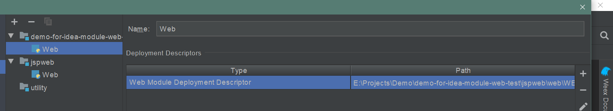

*  `A` 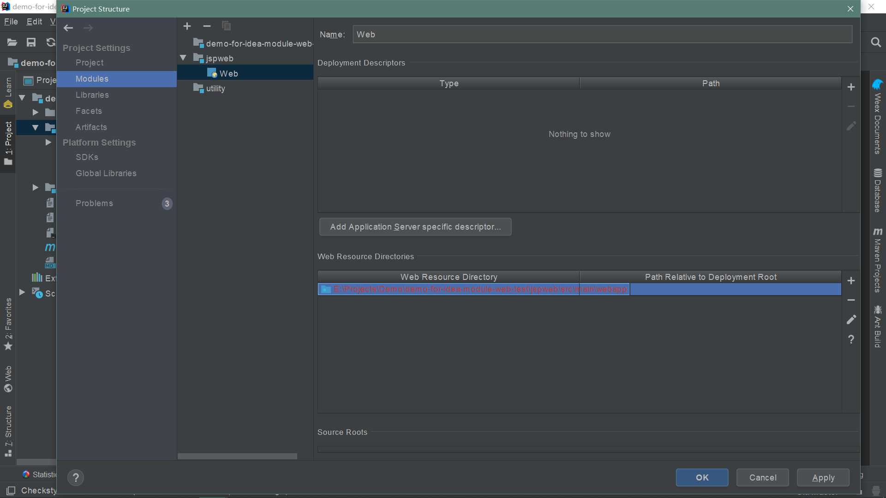
*  `更改src\main\webapp -> web` 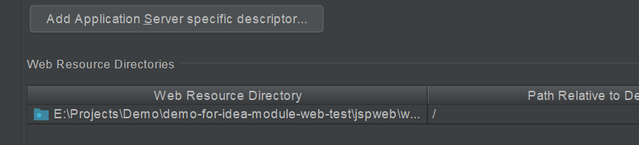
*  `图示点击+` 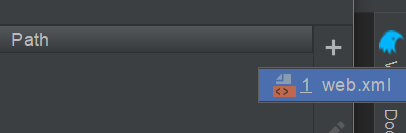
*  `B` 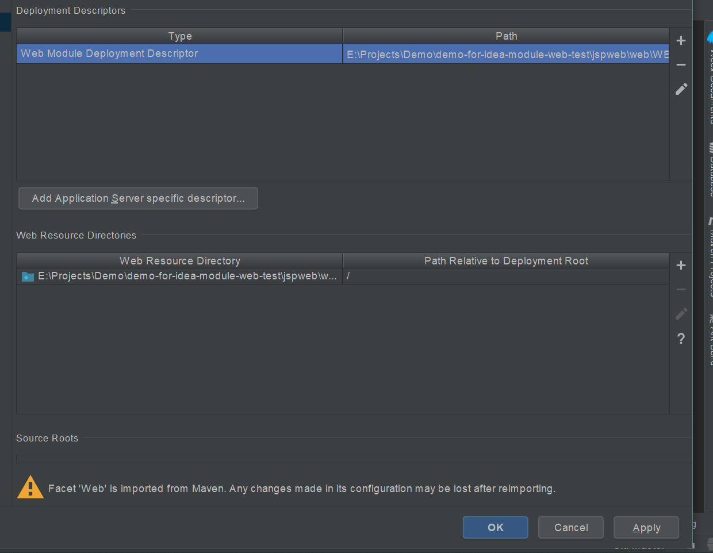

*  `配置tomcat` 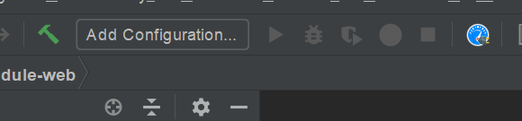
*  `配置tomcat` 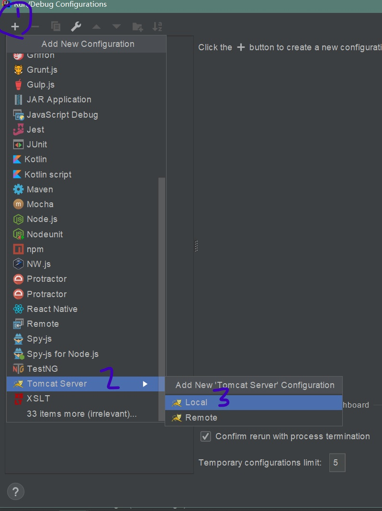
*  `配置tomcat` 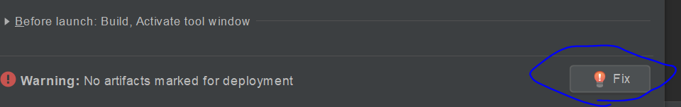
*  `配置tomcat` 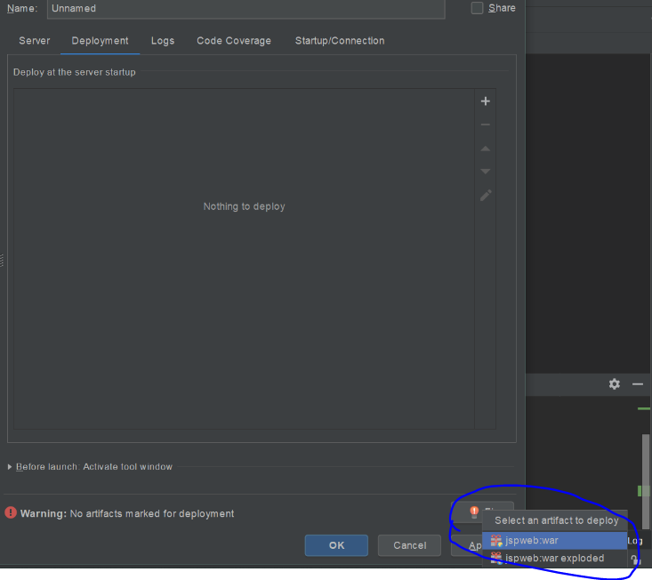
*  `配置tomcat` 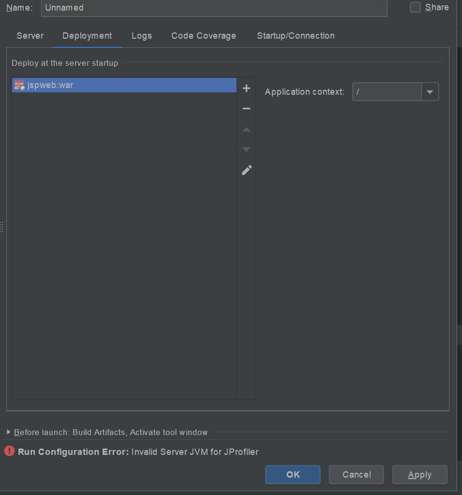
*  `配置JDK` 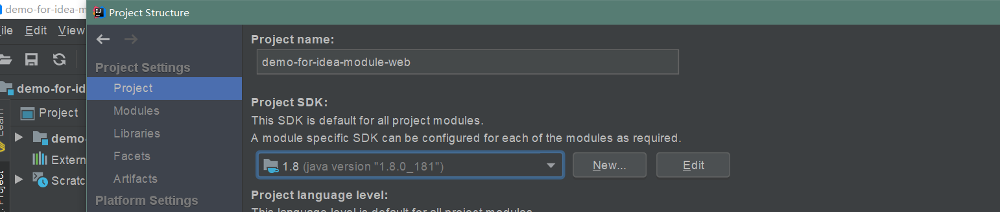 

*  `最终` 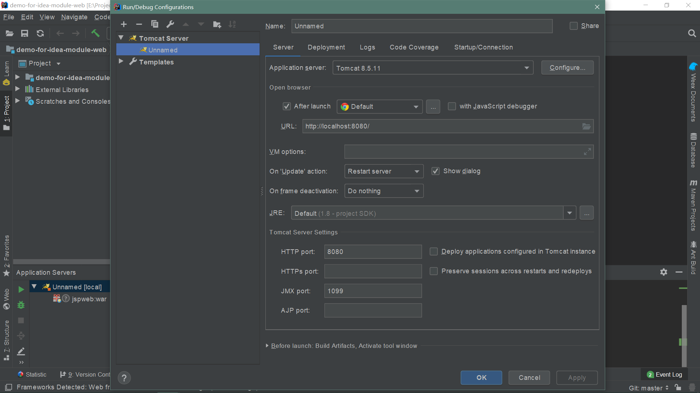

*  `运行(推荐Debug)` 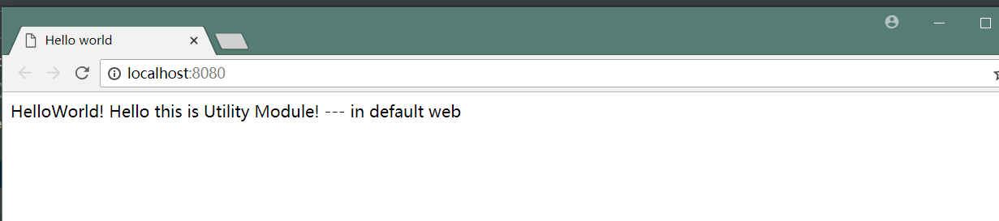
